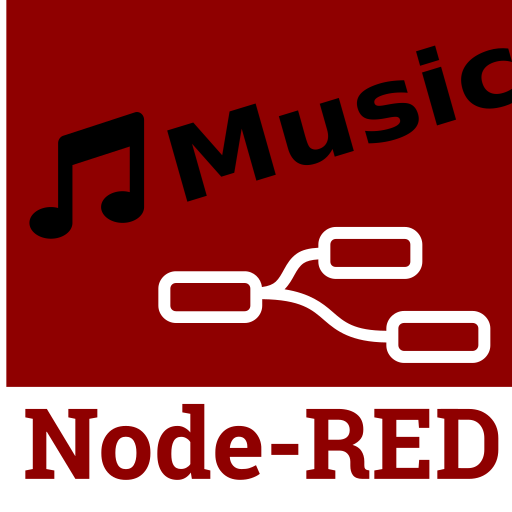

# node-red-contrib music


Designed for live-coding, this package offers a range of nodes to generate beats, subdivide them into bars and sections, and to generate sound synthesis instructions for the SuperCollider audio synthesis platform. Messages are sent from node-red to Supercollider via OSC.

# Installation

* You will need node-red: instructions are at <https://nodered.org/docs/getting-started/>
* Download and install [SuperCollider](https://supercollider.github.io/) (See note below on RPi)

# Start the engines

* Start SuperCollider and go to Language | Boot Server. (See note below on RPi)
* Start node-red, e.g. with the `node-red` command on the command-line
* Point your browser to <http://127.0.0.1:1880>
* In the pull-down menu (top right), choose "Manage Palette", go to the "Install" tab then search for "music" and install all of the nodes associated with node-red-contrib-music
* You also need to install the package node-red-contrib-osc as this is used to send the synthesis instructions via OSC to SuperCollider

# Create

There are some step-by-step instructions, including getting going on a Raspberry Pi at <https://stevenaeola.github.io/node-red-contrib-music/>.  If you're not on a raspberry Pi you can skip the first two sections. Then there's a section with a brief introduction to node-red if you don't already know. The specific details on node-red-contrib-music are at <https://stevenaeola.github.io/node-red-contrib-music/making-music> and onwards.

For video demonstration(s) see <https://www.youtube.com/playlist?list=PL5Tj84YnQVdIMXqM-mX85yGdWqBepwAIP>

# Raspberry Pi Installation

* Although node-red is bundled with Raspbian, it's not a very recent version, so you probably want to follow the instructions at <https://nodered.org/docs/hardware/raspberrypi>
* If you are working on a Raspberry Pi then scsynth (the part of SuperCollider that we need) is already installed with [Sonic Pi](https://sonic-pi.net/) and so is bundled with Raspbian. You will probably want to use a separate sound card with a RPi, a cheap USB one is fine, or you can use an expensive HiFi one if you wish.

* To start scsynth (part of SuperCollider) you need to run a shell script via the command line. Step-by-step instructions are at <https://stevenaeola.github.io/node-red-contrib-music/getting-started>. The shell script is included in the home directory of the `node-red-contrib-music` (versions for USB and non-USB audio). You may wish to make a symbolic link to run it from your home directory

```
ln -s ~/.node-red/node_modules/node-red-contrib-music/startsc-rpi-usb.sh ~/startsc.sh 
```

* You can use an [IQAudio sound card](http://www.iqaudio.com/downloads/IQaudIO.pdf) but you will need to edit your `/boot/config.txt` to comment out `#dtparam=audio=on` and add

```
dtoverlay=iqaudio-dacplus
dtoverlay=i2s-mmap
```


# Compatibility

node-red-contrib-music has been tested with

* OSX 10.13.4 on a MacBook Pro
* Windows 10
* PiTop OS release 2018-05-25 on a [pi-top](https://pi-top.com/) with RPi3 and a bog standard USB sound card
* A standalone RPi3 with an [IQAudio sound card](http://www.iqaudio.com/downloads/IQaudIO.pdf)
* SuperCollider 3.8.0 - 3.10.2
* node-red 0.18.3 - 0.20.3
* node v8.11.3 - v11.11.0
* npm 5.6.0 - 6.9.0

If you get it working on some other combination then do let us know

# Why node-red-music (NRM)?

NRM has the following aims:

* To be accessible. It has been tried it out with success in quite a few UK schools, both secondary (11-) and primary (-11).
* To be transferable, both in the tech and musical domains. Learning
  from NRM should be able to translate out of its own context. It sits
  on top of node-red, which itself sits on top of JavaScript. The
  basic syntax is graphical, but digging deeper the syntax relies on
  JSON. Snippets of pure JavaScript can be used, but are not
  necessary. From the musical perspective it tries to use standard
  musical notation e.g. scales start at 1, not 0. There are excellent
  domain-specific languages out there e.g. tidal, sonic-pi, but we
  emphasise transferability above brevity.
* To encourage collaboration. It is easy to synchronise across
  different instances. Many people see tech as an isolating and
  uncreative domain, we hope to address that misconception.
* To inter-work with other musical systems. Live sampling and replay is
  supported, it is also to easy to interact with other
  programs/systems via OSC, MIDI, WebSockets, UDP or whatever.
* To support alternative interfaces. Node-red is targeted at IoT
  applications. Using this support it is easy to control music
  via virtual interfaces such as twitter, or other web
  services. Physical devices can be controlled by or used to control
  NRM code, and many gadgets have contributed support via
  dedicated node types.
* To be open source. It builds on the work of others that have made their work freely available, and the node-red community is constantly building new ways of interacting. We often overlook the positive societal benefits of the open source movement, and model it offers for human progress through sharing and collaboration.
